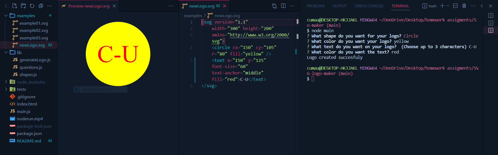

# SVG-logo-maker

clink link to open terminal
[video](https://cumauu73.github.io/SVG-logo-maker/)
## Description
 This is the basic SVG logo maker using integrated terminal.

 ## Instaling
 1. Install 'node.js' https://nodejs.org/en/download.
2. Install inquirer by typing `npm i inquirer` in the terminal's command line.
3. Clone this repo to your local computer https://github.com/cumauu73/SVG-logo-maker.
4. Install dependencies by typing `npm install` in the terminal's command line.
5. Install devDependencies by typing `npm install --save-dev jest` in the terminal's command line.

## How Can I Usage
To start the application, type `node index.js` on the command line then press ENTER the you have to select of 4 messages to customize your logo: 
* Choose the logo shape: Circle ,Square or Triangle
* Write the color keyword for the logo shape color.
* Write up to three characters to use as the text display on the logo.
* Write the color keyword for the logo text color.

## How it Looks

